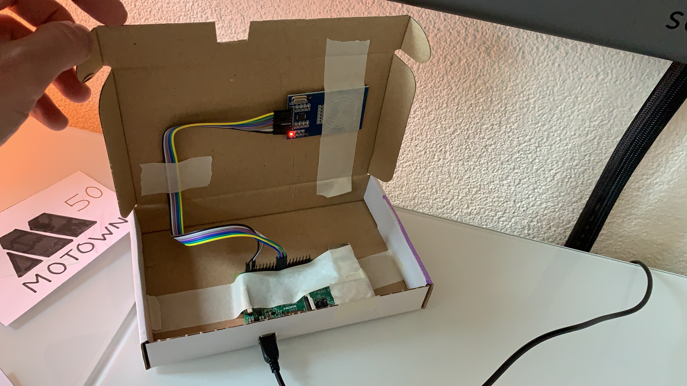
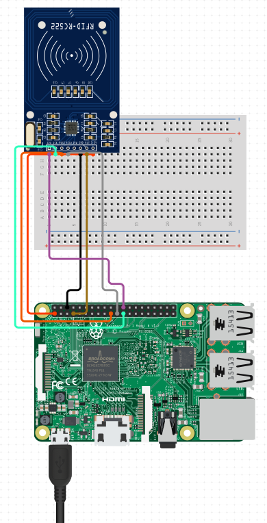
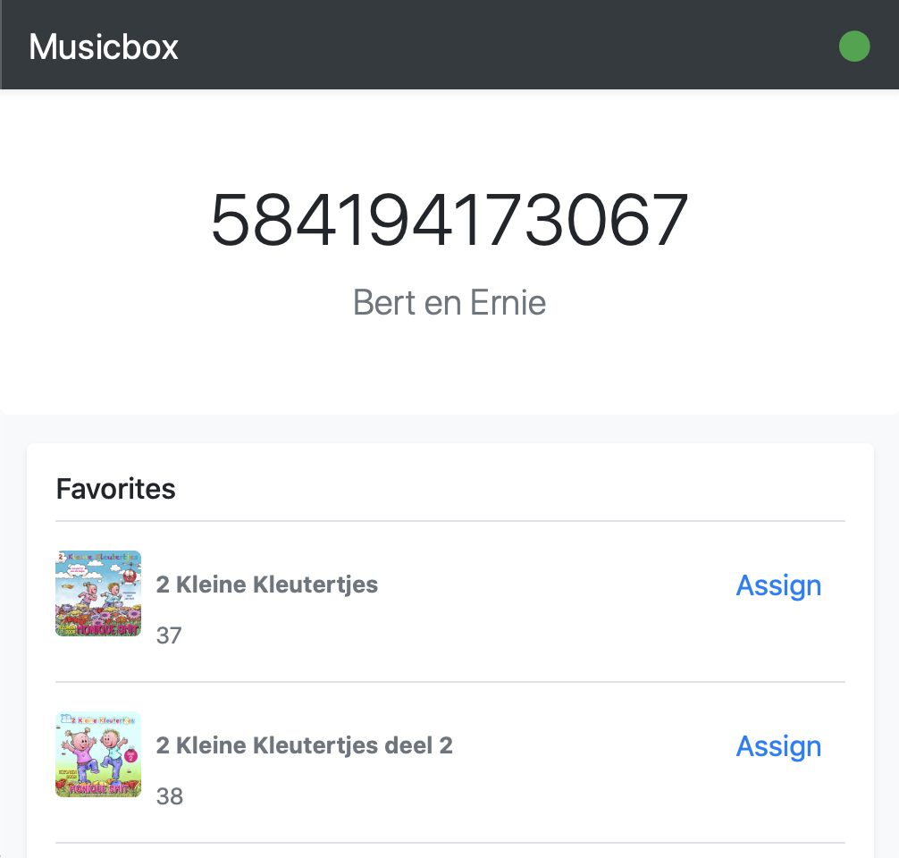

# Musicbox

A fun project to do with kids! Reads RFID tags, and plays associated music on a SONOS system.




## Hardware

### Receiver

Musicbox requires a MRFC-522 module (± €5) connected to any Raspberry Pi (with a network connection).

[Instructions](https://pimylifeup.com/raspberry-pi-rfid-rc522/)




### Tokens

You can find very cheap NTAG 213 stickers that will work decent with the MRFC-522 module.

We stick them on a 9x12,7 cm piece of paper with a nice drawing.


## Web Interface

A web interface allows you to assign RFID tags to SONOS favorites and playlists.




## Setup

After you have connected the MRFC-522 module to the Raspberry Pi, we setup the Musicbox!

### Raspbian

First, have a headless Raspbian on your Pi (WiFi configured and SSH enabled).

- [Installing Raspbian](https://www.raspberrypi.org/documentation/installation/installing-images/README.md)
- [Configure Wifi & SSH](https://www.raspberrypi.org/documentation/configuration/wireless/headless.md)

> Please change the default password for the `pi` user!

### Enable SPI

Please use `raspi-config` to enable SPI:

```sh
sudo raspi-config
```

- Select: 5 Interfacing Options
- Select: P4 SPI
- Enable!

```sh
sudo reboot
```


### Dependencies

Install required packages:

```sh
sudo apt-get update
sudo apt-get upgrade
sudo apt-get install \
    python3-dev \
    python3-pip \
    git

git clone https://github.com/tader/musicbox
cd musicbox
sudo pip3 install -r musicbox/requirements.txt
```


### Configure SONOS CLI

Setup a SONOS developer account and a new integration. [Instructions](https://github.com/bwilczynski/sonos-cli)

The `sonos login` command expects you to be able to run a webbrowser on the Pi.
As workaround we can hack the command in the following way:

```
sudo nano /usr/local/lib/python3.7/dist-packages/sonos/commands/login.py
```

Add a print statement on line 63:

```python
@click.command()
@config_required
def login():
    url, state = auth.login()
    print(url)  # <-- Add this print statement!
    webbrowser.open_new(url)
```

During the `sonos login` command, the url will be printed, on your computer open the url, sign in and then you will be redirected to `http://localhost:5000/xxxxxxx`, the page will fail to load. Copy this url, open a new SSH connection to your Pi and execute `curl '<copied url>'`, eg., `curl 'http://localhost:5000/xxxxxxx'`. The login command will then succeed, most likely.

Execute the following commands to login and set your household and group:

```sh
sonos login
sonos set household
sonos set group
```


## Usage

Manually start the musicbox process, SSH into the Pi and:

```
cd musicbox
sudo nohup python3 -m musicbox &
```

You can logout now.

In a webbrowser you can browse to the IP of your Pi, it will show you your SONOS favorites and playlists.

- Place an RFID tag on the reader, the jumbotron will switch from 'NO CARD PRESENT' to the id of the tag.
- Choose a favorite or playlist (if you don't have any, add one using the SONOS app and refresh the page).
- Click the Assign button for the item. The item will now be assigned to the tag.

- Remove and replace the tag, the assigned item should start playing.
- Repeat for more tags!


## Caveat

I have not found a way to clear the SONOS queue.
If you let a toddler play with the system, don't be surprised to see a gazillion items in the queue...
